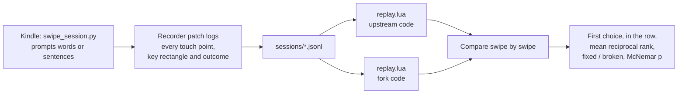
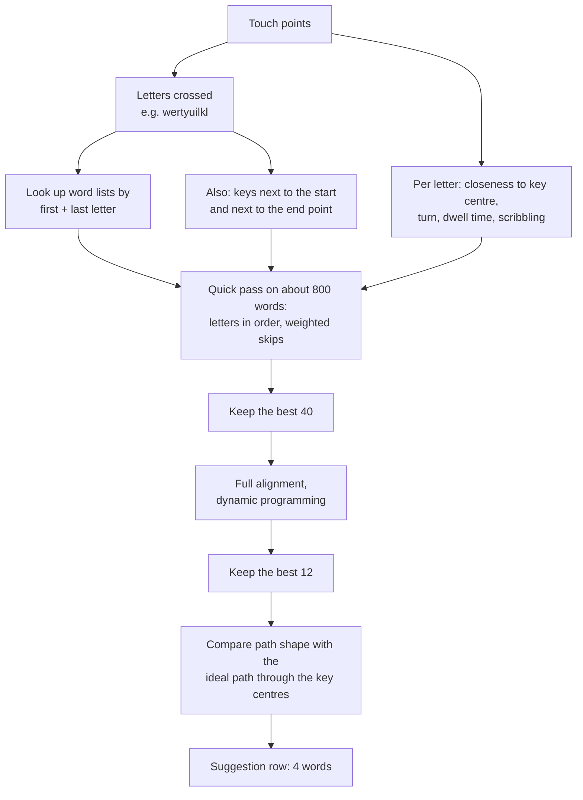
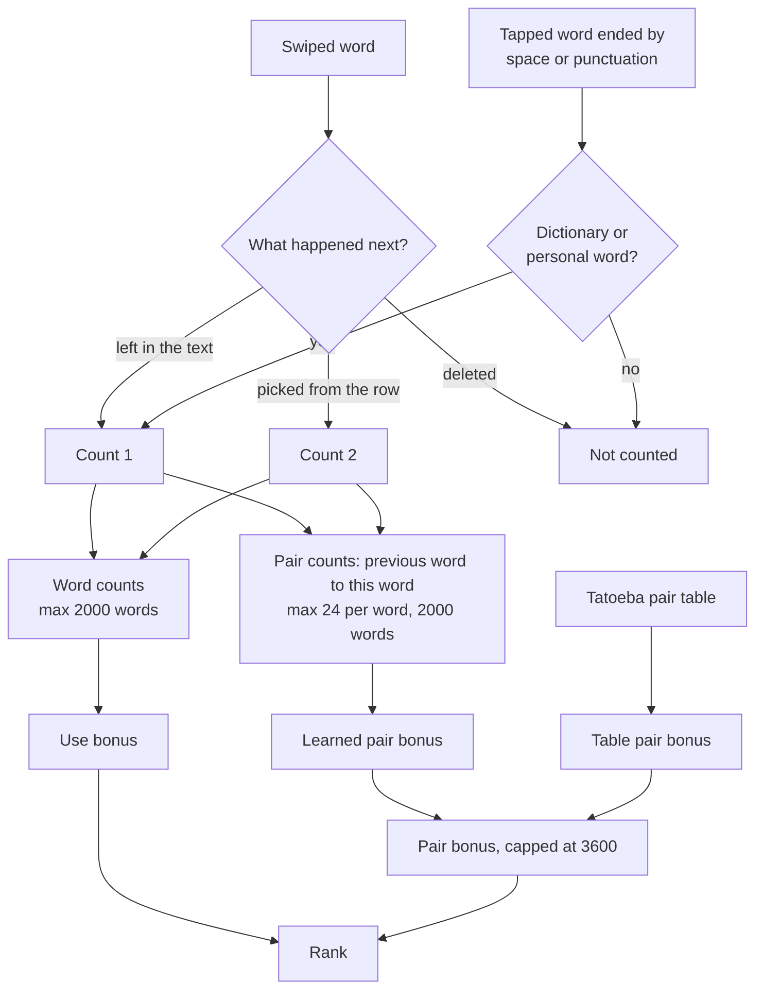
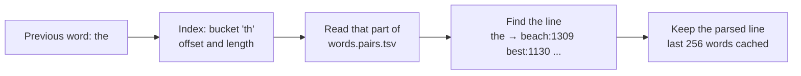
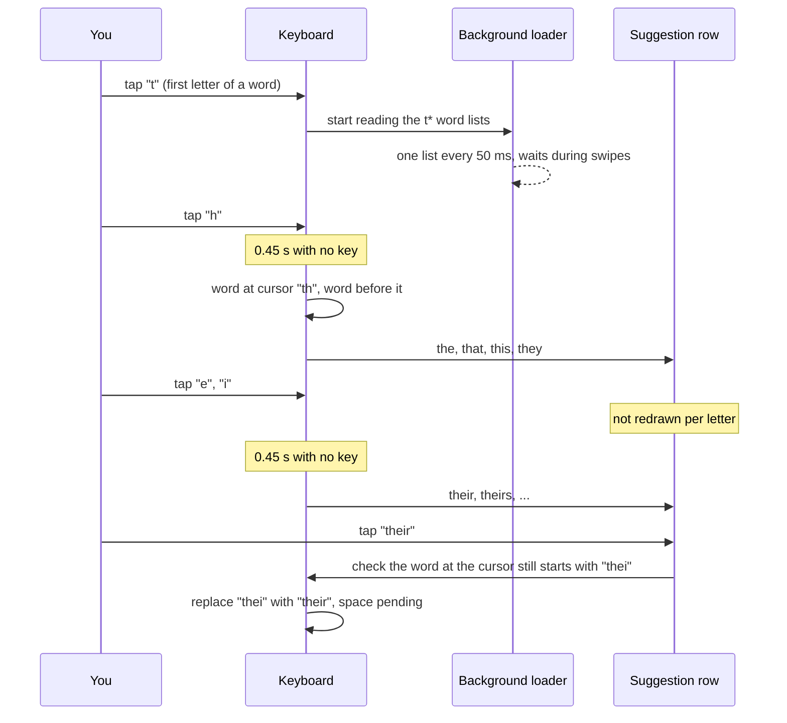
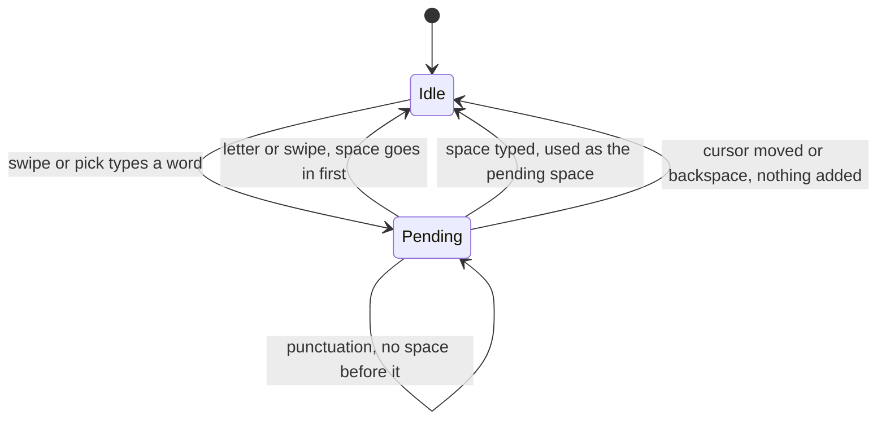
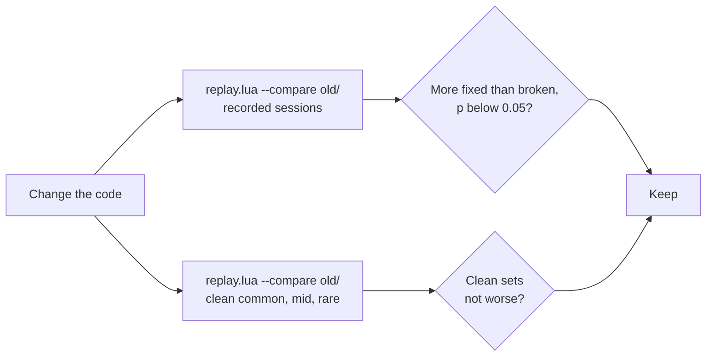

# Tapless for KOReader

Swipe typing for KOReader.

This is my fork of [azac/tapless.koplugin](https://github.com/azac/tapless.koplugin).
It fixes a lot of missed and wrong words, and adds a few typing options.
Most of the recognition work was tuned on real swipes recorded on a Kindle
Paperwhite. Some of it is up for review upstream in
[#2](https://github.com/azac/tapless.koplugin/pull/2) and
[#4](https://github.com/azac/tapless.koplugin/pull/4). The rest is here
while I test it.


## Installation

Copy the `tapless.koplugin` folder into KOReader's `plugins` folder and
restart KOReader. If Tapless is already installed, replace the old folder.

## Compared with upstream

The same swipes, replayed through upstream 0.4.0 and through this fork.
"First choice" is the word that gets typed. "In the row" means the word is
anywhere in the suggestion row.

| | Upstream 0.4.0 | This fork |
|---|---|---|
| Sentences, first choice (670 swipes) | 54% | 71% |
| Sentences, in the row | 64% | 77% |
| Random words, first choice (212 swipes) | 40% | 62% |
| Random words, in the row | 48% | 71% |
| Random words of 8 or more letters, first choice | 14% | 41% |
| Swipes that didn't start on the word's first key, first choice | 0% | 30% |
| Clean generated swipes, common words | 96% | 98% |
| Clean generated swipes, mid-frequency words | 93% | 96% |
| Clean generated swipes, rare words | 88% | 86% |

On the sentences, the fork gets 120 swipes right that upstream got wrong,
and 3 wrong that upstream got right. On the random words it's 51 and 3.

Rare words are slightly worse. That's a deliberate trade: common words
count for more, so the odd rare word now loses to a common one with a
similar shape.

Recognising a swipe takes about 25 ms on a Kindle Paperwhite, around twice
upstream's time. It isn't noticeable next to the screen refresh.

<details>
<summary><b>How these were measured</b></summary>

- 882 swipes over 11 sessions, recorded on a Kindle Paperwhite (12th gen)
  with KOReader v2026.07.2 using `tools/swipe_session.py`. The word
  sessions prompt random words from three frequency bands. The sentence
  sessions prompt short everyday sentences, 20 at a time.
- `tools/replay.lua` feeds the recorded touch points back through each
  version's recognition code, so both versions see exactly the same
  swipes. Learned word pairs are built up as the sentences are typed and
  reset between sessions, as they would be on a fresh install.
- The clean swipes are generated: a straight line between key centres with
  a short pause on each key, 1500 words from each frequency band. They
  catch changes that break words which used to work.
- The fork's ranking weights were fitted on the word sessions, so treat
  that row as a bit optimistic. The sentence sessions weren't used for
  fitting.
- Swipes that upstream cut short when a second finger touched the screen
  don't show up here at all, because the recordings were made with that
  fix in. Before the fix, it cut short 7 of 32 swipes in one session.
- "Fixed" and "broken" counts come with an exact McNemar test. Both
  headline differences are far beyond chance (p below 1e-11).

#### Technical details



The recorder stores the raw touch events, not what the keyboard made of
them, together with the key rectangles on screen at the time. Replay
rebuilds the keyboard layout from those rectangles and drives the gesture
code with the recorded events, so any version of the recognition code can
be run on the same swipes. Each attempt also records what happened next:
kept, picked from the row, or deleted. Replay uses that to learn what the
device would have learned.

The McNemar test only looks at the swipes where the two versions disagree.
If a change made no difference, each of those would be a coin toss between
fixed and broken, and p is the chance of a split at least as uneven as the
one seen. 120 fixed against 3 broken has p around 6e-32.

</details>

## What's changed

### Recognition

- Swipes that start just inside the next key over still find the word.
- A corner you cut short can lend a letter from the key next to it.
- Scribbling back and forth on a key types a double letter.
- Rare short fragments like "bq" and "gtg" stop beating real words.
- Common words count for more against the shape of the swipe.
- Spellings that only repeat letters ("wee", "weee") no longer fill the
  row.
- Swipes that start on the number row type a word, not a digit.

<details>
<summary><b>How recognition works now</b></summary>

Every swipe gives a string of letters the finger passed over, such as
`wertyuilkl` for "well". Candidate words are looked up in the dictionary
by first and last letter, scored on how well their letters line up with
that string and with the actual touch points, then ranked with word
frequency.

**Starting on the next key.** On e-ink it's easy to land just inside a
neighbouring key. If the swipe starts within a quarter of a key of another
key, words starting with that key are looked up too. They pay a small
penalty, much smaller than a word whose first letter the swipe missed
completely.

**Borrowed letters.** A fast swipe often cuts a corner, so the key at the
corner is never touched. A word can take up to two of its inner letters
from a key next to one the path passed over. This only counts where the
path actually turned, so keys you slide straight past don't lend letters.
Each borrowed letter costs a little.

**Double letters.** A swipe can't show a doubled letter, so "too" and "to"
look the same. A short back-and-forth on one key now counts as a repeated
letter and favours the doubled spelling. Small wobbles and sharp corners
don't count.

**Rare short words.** Dictionaries are full of short rare strings (bq,
chg, gtg) that fit almost any short swipe. Words of four letters or fewer
that are rare pay a penalty, based only on length and frequency, so it
works the same in every language. A word you use often is exempt (see
below).

**Ranking.** The balance between swipe shape and word frequency was fitted
to the recorded swipes by maximum likelihood, then pulled back towards the
old values so rare words didn't lose too much. That's where the 2 point
drop on rare clean swipes comes from.

**Repeated letters in the row.** Words that differ only in doubled letters
("we", "wee") look the same to a swipe. At most two of them take a place
in the suggestion row, and spellings with a letter three times in a row
are left out.

**The number row.** The keyboard has a row of digits above the letters.
A swipe that starts on a digit and goes on across letters is taken as
starting on the letter key below. A tap, or a short slide that doesn't
reach another letter, is left to KOReader, so digits and the characters
you get by sliding off a digit key still work. In the sessions recorded
before this change, 27 swipes started on the number row and typed a digit
or a symbol instead of a word.

#### Technical details



**Letters and how much each one counts.** As the finger moves, every new
key it enters adds a letter. Each letter then gets an intent weight
between 0.15 and 1, for how likely it is that the finger meant that key
rather than passed over it:

```
intent = 0.15 + 0.45 × closeness + 0.30 × turn + 0.10 × dwell

closeness  1 at the key centre, 0 at 0.65 of a key away
turn       how sharply the path turned at its closest point, 0 to 1
dwell      time on the key compared with the average key, 0 to 1
```

The first and last letters always count at least 0.9. Skipping a letter
with a low weight, a key the finger only brushed on the way, costs little.

**Finding candidate words.** The dictionary is split into word lists by
first and last letter, so "well" is in the `wl` list. A swipe reads the
list for its own first and last letters, plus the lists for up to two
keys next to where it ended and up to two keys next to where it started,
when it started within a quarter of a key of them. Only words no longer
than the swipe's letter string are scored.

**Quick pass.** Each word's letters are matched in order against the
swipe's letters, taking the first place each letter can go. That gives a
path cost:

```
path cost = weight of the swipe letters the word skips
          + twice the weight of any skipped before its first letter
            or after its last
          + 6    if the first letter isn't the key the swipe started on
            (1 instead, if it's the neighbouring key the swipe started in)
          + 4    if the last letter isn't the key the swipe ended on
            (5 if it's taken from a key next to the end point)
          + 0.5  per letter borrowed from a neighbouring key (at most 2)
          + up to 4 for how far the touch points were from the key centres
```

A key can only lend its neighbours a letter where the path turned by at
least 0.3 radians there. Neighbours are keys whose centres are within 1.2
key sizes. An edit-distance check (up to two edits) and a special case for
short words can lower the cost for near misses.

**Ranking.** Everything is put on one scale, where lower is better:

```
rank = 949 × path cost
     − frequency                         (Zipf × 1000: "the" is 7730)
     + 3122 if the word has 4 letters or fewer, is rarer than Zipf 3
            and you've used it fewer than 4 times
     − word pair bonus                   (see Learning)
     − 3354 × scribble confidence for each doubled letter
     − your own use bonus                (see Learning)
```

The path cost weight (949), the rare-word cost, the scribble credit and
the path shape weight (3089, below) were fitted by maximum likelihood on
the recorded word sessions, using `tools/fit_weights.lua`, with
leave-one-session-out checks. The full fit made rare words lose too often
on the clean swipes, so the shipped path and shape weights sit halfway
between the old ones and the fitted ones, on a log scale.

**Full alignment.** The best 40 are scored again with dynamic programming
instead of the first-fit match. The table has one row per letter of the
word and one column per swipe letter, and there are three copies of it,
for 0, 1 or 2 borrowed letters. Each cell holds the cheapest way to match
the word so far: either skip a swipe letter, paying its intent weight, or
match it, paying the distance from that touch point to the key centre. So
a letter that appears twice in the swipe is matched where it fits best,
not just where it comes first.

**Path shape.** The best 12 get a last check on the whole shape. The
swipe and the ideal path through the word's key centres are both resampled
to 20 evenly spaced points. The average distance between matching points,
in key sizes, plus a little for the difference in length, is multiplied by
3089 and added to the rank.

**Scribbles.** On each key, turns sharper than 45 degrees are added up. If
they come to at least 0.7 of a full circle and the path on that key is at
least 0.65 of a key long, the key gets a scribble confidence, which favours
words with that letter doubled.

**The number row.** The starting point is checked against the digit keys
first. If it's on one, the key in the row below at the same position is
used as the start. If the swipe then crosses fewer than two letters, it's
handed back to KOReader untouched.

**Filling the row.** At most two words with the same shape once doubled
letters are collapsed ("we", "wee"), and no word with a letter three times
in a row.

</details>

### Learning

- Words you keep typing rise up the list.
- The word that usually follows the one before it wins ("the sun", not
  "the sin").
- Words you tap out letter by letter count too, not just swipes.

<details>
<summary><b>How learning works</b></summary>

**Your words.** Every word you keep in the text is counted. A word you
pick from the suggestion row counts double, and a word you delete straight
away isn't counted. From two uses a word gets a boost, which grows with
use up to a limit, and never lifts a word above the most common words. A
word used four times or more is also exempt from the rare short word
penalty. Up to 2000 words are kept, dropping the least used. The counts
are saved in KOReader's settings.

**Tapped words.** A word you tap out and finish with a space or
punctuation is counted once and learned after the word before it, the
same as a swiped word you keep. Only dictionary and personal words
count, so typos aren't learned.

**Word pairs.** Tapless already learned which word you type after which.
The fork adds a table of common word pairs for English, so this works from
the first sentence instead of only after you've typed a pair yourself. A
pair's bonus depends on how much likelier the word is after the previous
word than anywhere else. The learned bonus and the table bonus are added
together, up to the same limit the learned bonus had on its own. It
only applies when the previous word is followed by just a space, so after
a full stop or a comma nothing is assumed.

On the sentence sessions the table alone took first choice from 68% to
71%, with 17 swipes fixed and none broken. The fixes are the look-alike
mistakes: "tu" for "to", "will" for "well", "while" for "whole", "sin" for
"sun".

The table is 1.6 MB and sits next to the English dictionary. Only the
part for the previous word is read, when it's needed. It was counted from
the English sentences of [Tatoeba](https://tatoeba.org) (CC BY 2.0 FR) by
`tools/build_word_pairs.py`, leaving out any sentence that shares four
words in a row with the test prompts, so replays of the test sessions stay
fair. See `tapless.koplugin/dictionaries/en/ATTRIBUTION.txt`.

Learned pairs are capped at 24 following words for each word and 2000
words in total, because they're saved in KOReader's settings file, which
is rewritten in full on every save.

Installing English from the dictionary manager's download list replaces
the bundled dictionary with one that has no pair table. Everything still
works, just without the table.

#### Technical details



Every bonus is in the same units as word frequency, Zipf × 1000, so 1000
is worth one step on a scale where "the" is about 7.7 and a rare word
about 2.

**Use bonus.**

```
use bonus = 0                          under 2 uses
          = 500 × log2(uses)           capped at 2000
          but never lifting the word's frequency past 5500
```

| Uses | 1 | 2 | 4 | 8 | 16 or more |
|---|---|---|---|---|---|
| Bonus | 0 | 500 | 1000 | 1500 | 2000 |

The ceiling means a word you use a lot can catch up with common words, but
never beat "the" or "and" on frequency alone.

**Learned pair bonus.** For a pair you've typed `count` times:
`600 × log2(count + 1)`, capped at 3600. The counts stop at 255. When a
word has more than 24 followers, the least used goes. When there are more
than 2000 previous words, the one followed least often goes.

**Pair table bonus.** Counted from 14.9 million words of Tatoeba sentences:

```
bonus = 1000 × log10( P(word | previous word) / P(word) )
```

That's the pointwise mutual information in frequency units: how much
likelier the word is right after the previous word than in general. It's
capped at 3000, and pairs seen fewer than 3 times or earning less than 300
are dropped. Each previous word keeps its 64 most frequent followers,
140,000 pairs in all.

**The pair file.** The table is stored like the dictionary: one text
file, plus an index of where each part starts.



Pairs are only counted across spaces, the way the keyboard sees the
previous word. So "Hello, world" has no pair, because the comma breaks it.

</details>

### Typing

- Pause while tapping out a word and the row offers words that finish it.
- A second finger touching the screen no longer cuts a swipe short.
- A swipe that only touches one letter types that letter.
- Fast tapping doesn't turn into swiped words.
- Spaces go in front of the next word, so punctuation sits right.

<details>
<summary><b>Typing details</b></summary>

**Finishing tapped words.** When you stop tapping for about half a
second, the row shows up to four words that start with what you've typed.
They're ranked the same way as swipes: how common the word is, whether it
usually follows the word before, and how often you use it. Tap one and it
replaces what you typed, keeps your capitals ("Th" gives "The"), and the
next word gets its space like after a swipe. The row isn't redrawn on
every letter, only when you pause, to keep e-ink refreshes down. If you
carry on typing past what the row was made for, a stale suggestion can't
be picked by mistake. The offer to add an unknown word to your personal
words still shows when nothing matches. It can be turned off under
`Tools → Tapless → Suggest words while typing`.

The most common 256 words for each first letter are always searched.
From three letters in, if they don't fill the row, the rest of the
dictionary is searched too. Those word lists are read in the background
while you type the first letters, one at a time, so typing never waits
for the disk. The first time you start a word with a letter they may not
all be ready yet, so rarer words can be missing from the row for that one
word.

Typing the words from the recorded sessions and pausing once, after the
second or third letter:

| | Sentences (553 words) | Random words (212) |
|---|---|---|
| Word in the row after 2 letters | 70% | 17% |
| Word first in the row after 2 letters | 49% | 4% |
| Word in the row after 3 letters | 86% | 61% |
| Word first in the row after 3 letters | 64% | 27% |

Picking the word at that one pause saves about a quarter of the
keystrokes in the sentences. Word pairs are why the right word is so
often first in sentences, and the wider search after three letters is
what finds the less common random words.

**Second finger.** A thumb resting on the edge of the screen mid-swipe was
paired with the swiping finger into a two-finger gesture, and the swipe
ended part-way through. It's now ignored until it lifts. This was the
biggest single cause of misses. Pinch zoom and two-finger typing are
unchanged.

**Two quick taps.** On KOReader v2026.07.2 and older, two fingers landing
close together were merged into one two-finger tap and both keys were
lost. The fork backports KOReader's fix (koreader#15840). Nothing is
changed on newer KOReader.

**One-letter swipes.** On e-ink a tap often drifts far enough to count as
a swipe, and the keypress was lost. A swipe that only crosses one letter
now types it.

**Fast tapping.** A short slide within half a second of tapping a letter
types the key it started on.

**Spaces.** The space after a swiped word is added when the next word
starts, so "hello, world" comes out right and text doesn't end in a stray
space. A swiped word after a tapped word, or after punctuation, gets its
space too.

**Other keyboard patches.** Letter swipes keep working when another plugin
or patch replaces the key handlers, like the ZenOS keyboard patch.

#### Technical details

**Completions.**



Candidates come from the 256 most common words for the first letter,
your personal words, and, from three letters if those leave the row short,
every word list for that first letter that's already in memory. Each
candidate that starts with the typed letters (accents ignored) is scored:

```
score = frequency + pair bonus after the previous word + use bonus
```

The typed word itself, blocked words and spellings with a letter three
times in a row are left out, and the best four are shown. A pick only goes
through if the text box is the same one, the word at the cursor still
starts with the letters the row was made for, and the picked word still
starts with the word at the cursor. Otherwise the row is just cleared.

The previous word for completions is the last run of letters before the
word being typed, if only spaces separate them, the same way the keyboard
finds it for swipes. Input method layouts (Chinese, Japanese, Korean,
Vietnamese) get no completions, because their tapped letters are still
being composed.

**Second finger.** KOReader's gesture detector pairs a new touch with one
already down, to recognise pinches and two-finger taps. While a swipe is
being drawn on the keyboard, Tapless unpairs a new touch as it lands and
parks it in a state that ignores its events until it lifts.

**Spaces.**



A pending space remembers the text box and the cursor position. It's only
used if both are unchanged when the next word starts.

**Fast tapping.** A swipe that starts within 500 ms of a tapped letter and
travels less than 0.6 of a key is typed as a tap on the key it started on.

</details>

### Suggestion row

- Hold a suggestion to block that word.
- The row clears its e-ink ghosting every few changes.
- All four slots are used for words.

<details>
<summary><b>Suggestion row details</b></summary>

Blocked words are listed in the dictionary manager and can be unblocked
there. Adding a word to your personal words unblocks it.

The row gets a flash refresh every six changes to clear ghosting. Swipes
themselves stay flash-free.

The language used to take up a suggestion slot. It's now shown on the
space bar (see below), so all four slots show words.

#### Technical details

Each slot is redrawn on its own, and only when its word changes, with a
fast partial e-ink update. Fast updates leave faint ghosts of earlier
words, so every sixth time the row changes, the whole row gets one flash
update. Blocked words are stored per language and skipped when words are
looked up, for swipes and completions alike. Blocking the word a swipe
just typed replaces it with the next suggestion.

</details>

### Languages and keyboard size

- Pick your languages the first time the keyboard opens.
- The language is shown on the space bar. Hold space to switch.
- Keyboard size and key text size options.
- Bundled dictionaries can be removed.

<details>
<summary><b>Languages and size details</b></summary>

- Languages can be enabled and disabled in the dictionary manager, under
  `Tools → Tapless → Manage dictionaries`. At least one has to stay
  enabled, and the last one can't be removed.
- With only one language enabled, holding space types a space.
- Personal words opened from `Tools → Tapless` show the list for the
  current language.
- `Keyboard size` can be Same as KOReader (the default), Extra compact,
  Compact, Normal or Large. It changes the height and keeps the keyboard
  full-width. Same as KOReader follows KOReader's own compact keyboard
  setting.
- `Keyboard text size` can be Auto, Small, Normal or Large. Auto matches
  the keyboard size, or keeps KOReader's key font size when the size is
  Same as KOReader.

#### Technical details

Each dictionary is a folder with a manifest and its word lists, bundled
in the plugin or downloaded to KOReader's data folder. A downloaded one
with the same name takes over from the bundled one. The folders are only
read again when one of them changes, since reading every manifest is slow
on an e-reader. Word lists are loaded when first needed and kept in memory,
about 30 MB for the whole of English at most. Switching language frees the
old language's lists.

</details>

## Options

These are under `Tools → Tapless`. This one is on by default:

- **Suggest words while typing**: pause while tapping out a word and the
  suggestion row offers words that finish it.

These are off by default:

- **Slide on space to move cursor**: slide left or right along the space
  bar to move the text cursor. Holding space still switches language.
- **Double space types a period**: a second space right after a word, or a
  space right after a swiped word, becomes ". ". Not used on input method
  layouts (Chinese, Japanese, Korean, Vietnamese).

## Code layout

The plugin's Lua files are grouped by what they do. `modules.lua` lists
where each one lives, and the plugin, tests and tools all load them by
name through it.

| Folder | What's in it |
|---|---|
| `koreader/` | Hooks into KOReader's keyboard and touch handling |
| `input/` | Turning touches and key presses into typed text |
| `recognition/` | Finding the words a swipe or tapped letters could be |
| `learning/` | The words and word pairs you keep |
| `dictionary/` | Reading, installing and managing word lists |
| `ui/` | Drawing the suggestion row and the swipe trail |
| `dictionaries/` | The word lists and word-pair tables themselves |

## Testing tools

None of this is in the plugin folder or changes the plugin.

- `luajit spec/run.lua` runs the tests.
- `tools/swipe_session.py` runs a prompted swipe session on a device over
  SSH, then replays it.
- `tools/replay.lua` replays recorded sessions through the plugin code.
  `--compare DIR` shows which swipes a change fixed or broke.
- `tools/clean_swipes.lua` generates clean swipes for regression checks.
- `tools/fit_weights.lua` fits the ranking weights to recorded swipes.
- `tools/build_word_pairs.py` builds a dictionary's word-pair table.

<details>
<summary><b>More on the testing tools</b></summary>

`swipe_session.py` installs a temporary KOReader patch that shows words
or sentences to swipe and records every attempt: the touch points, the
keys, what was typed, and whether you kept it, picked another suggestion
or deleted it. It prints each result as you go. At the end it removes the
patch, copies the recording to `sessions/` and replays it. Learning is
paused while a session is recorded, so the test doesn't change your word
counts.

`replay.lua` prints first choice, in-the-row and mean reciprocal rank,
split by word length and by where the swipe started, next to what the
device showed at the time, plus the time each swipe took. `--compare`
lists every swipe that changed between two plugin folders, with a McNemar
p value. `--context` and `--usage` build up learned pairs and word counts
as the swipes are replayed, `--per-session` starts them over for each
session, and `--losses` shows at which step each missed word was lost.

Recordings go in `sessions/`, which is git-ignored because it contains
typed text.

#### Technical details



`fit_weights.lua` treats each recorded swipe as a choice between the
candidate words, with the chance of each word falling off exponentially
with its rank score (a conditional logit model). It finds the weights that
make the intended words most likely with Newton's method, reports standard
errors, and checks the fit by leaving each session out in turn and scoring
it with weights fitted on the others.

`clean_swipes.lua` builds a swipe for a word by moving in a straight line
between its key centres, pausing briefly on each, using the key positions
from a recorded session so they match a real device.

`build_word_pairs.py` reads sentence files (plain text, or Tatoeba's TSV
exports, compressed or not), counts pairs as described under Learning, and
writes `words.pairs.tsv`, `words.pairs.idx` and their checksums into the
dictionary's manifest. `--exclude` and `--exclude-words 4` leave out any
sentence sharing four words in a row with the test prompts.

</details>
